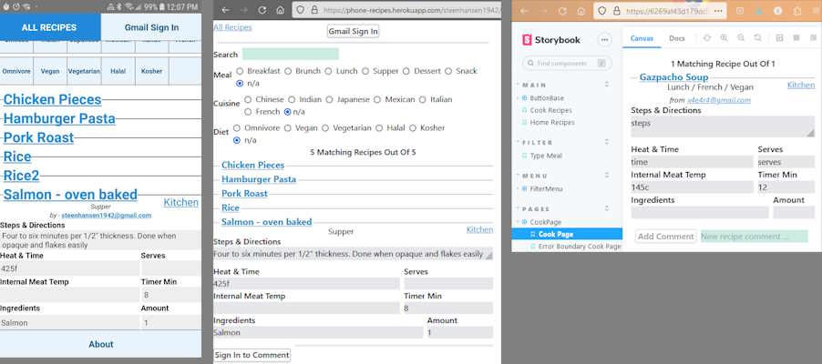

### Phone-Recipes app for mobile or browser. Multiple recipes with multiple stopwatches. Shared backend.
&nbsp;&nbsp;&nbsp;&nbsp;&nbsp;&nbsp;&nbsp;&nbsp;&nbsp;
| |Repo|Site|Shared Tech|Different Tech|Tests|
|-|----|----|----|-----|---|
|**Android**| [react-native -phone-recipes][rec_m] | [play.google.com /store/apps][rec_a]  | React-Hooks, OAuth2, Redux, MongoDB, [Storybook](https://6269af43d179dc004af9a1ec-ltzwmhwlbd.chromatic.com/?path=/story/pages-minimalpage--minimal-page)|**React Native** | |
|**Web**| [type-czech -phone-recipes][rec_g]   | [phone-recipes. herokuapp.com][rec_w] |  React-Hooks, OAuth2, Redux, MongoDB, [Storybook](https://6269af43d179dc004af9a1ec-ltzwmhwlbd.chromatic.com/?path=/story/pages-minimalpage--minimal-page)| **Node.js**, vite-plugin-ssr|Selenium E2E, Vitest JSX &amp; Mocha JS |

[ppd_g]: https://github.com/steenhansen/python-podcast-downloader
[gpd_g]: https://github.com/steenhansen/go-podcast-downloader#screen-shot
[gdo_w]: https://github.com/steenhansen/go-podcast-downloader/raw/main/Gui-Podcast-Downloader.exe.zip

[esg_g]: https://github.com/steenhansen/elixir-liveview-snake
[esg_w]: https://evening-eyrie-25210-f2edb2eac607.herokuapp.com/Projects-Game/Players-Name

| Functional Repos | Site                                                  | Tech                                                                                                                                                                                                                                                                                             |About|Tests|
| ------------------------------------ | -------------------------------------------------------- | -----------------------------------------------------------------------------------------------------------------------------------------------------------------------------------------------------------------------------------------------------------------------|--------------------------------- | --|
| [elixir-liveview -snake][esg_g]    | [evening-eyrie.herokuapp.com][esg_w]    | Elixir, Phoenix, LiveView, SVG                     | Elixir multi-player snake game with minimal Javascript | 
| [python-podcast -downloader][ppd_g]    |     | Python                      | Python podcast downloader for Windows console |
| [go-podcast -downloader][gpd_g]    | [Gui-Podcast-Downloader.exe.zip][gdo_w]    | Go channels, Fyne,  goroutines, and waitgroups                      | Go podcast downloader for Windows console and Gui |20
| [type-czech][tcz_g]                  | [npmjs.com/package /type-czech][tcz_n]                                     | TypeCzech, NPM                                                                                                                                                                                                                                    | Javascript runtime type checking à la clojure.spec with a tutorial of [75 pages of live editable examples](https://jsfiddle.net/steen_hansen/1Lshcept/?Example-Contents) on JsFiddle.                                                                |[2456](https://github.com/steenhansen/type-czech#run-2444-tests)
| [type-czech -always-on][aon_g]        | [type-czech-always-on .onrender.com][aon_w]  [150sec free hosting cold start] | TypeCzech, Ajax        | Type checking Roman, Word, Float, and Integer ajax variables in browser and server                                                                                             |
| [type-czech -canonical][can_g]        | [type-czech-canonical .onrender.com][can_w]  [150sec free hosting cold start] | TypeCzech                                     | Simplest run time type checking example                                                 |
| [rxjs-breakout][brk_g]               | [github.io/gh-pages][brk_w]                                 | RxJS, canvas, immutablejs   | Online breakout game  |
| [crash-sms][sms_g]                   |                           | Clojure, SMS, DynamoDB   | Old website monitor that ran on Heroku  |
| [rxjs-label -maker][lbl_g]            | [github.io/ rxjs-label-maker][lbl_w]                      | RxJS &amp; Snap-Shot Tests | RxJS interface with validation example         |
| [rxjs-drag -n-drop][drg_g]            | [github.io/ rxjs-drag-n-drop][drg_w]                       | RxJS         | Basic RxJs drag-n-drop example                                                                                                                                                                                                                                                                                          |
|                                      | [codepen.io/ steen-hansen][aut_c]        | RxJS Subjects &amp; BehaviorSubject              | RxJS log in example                                                                                                                                                                                                                                                       |     | [clojure-text-diff ][ctd_g] |     | Clojure | Clojure |
| [Either -Monad][mon_g]                |                                                          | Either Monad                                                                                                                                                                                                                                                                                             |                                                                                                                                                                                                                      |
| [Validation -Monad][val_g]            |                                                          | Validation Monad                                                                                                                                                                                                                                                                                         |                                                                                                                                                                                                                     |
| [Ramda- Transducers ][ram_g]          |                                                          | Ramda Transducers                                                                                                                                                                                                                                                                                        |                                                                                                                                                                                                                                                                                        |
| [React Native Google Signin Verified  ][rnt_g]          |                                                          | Google Signin, React Native                                                                                                                                                                       | Guide for using Google Signin with React Native                                                                                                                                                                                                                                                                                   |

[rec_a]: https://play.google.com/store/apps/details?id=com.fonecook3
[rec_m]: https://github.com/steenhansen/react-native-phone-recipes
[rec_g]: https://github.com/steenhansen/type-czech-phone-recipes
[rec_w]: https://phone-recipes.herokuapp.com/steenhansen1942/gmail.com
[tcz_g]: https://github.com/steenhansen/type-czech
[tcz_n]: https://www.npmjs.com/package/type-czech
[aon_g]: https://github.com/steenhansen/type-czech-always-on
[aon_w]: https://type-czech-always-on.onrender.com/#freehosting-wait-for-at-least-150-seconds

[can_g]: https://github.com/steenhansen/type-czech-canonical
[can_w]: https://type-czech-canonical.onrender.com/#freehosting-wait-for-at-least-150-seconds

[brk_g]: https://github.com/steenhansen/rxjs-breakout
[brk_w]: https://steenhansen.github.io/gh-pages/
[sms_g]: https://github.com/steenhansen/crash-sms
[lbl_g]: https://github.com/steenhansen/rxjs-label-maker
[lbl_w]: https://steenhansen.github.io/rxjs-label-maker/
[drg_g]: https://github.com/steenhansen/rxjs-drag-n-drop
[drg_w]: https://steenhansen.github.io/rxjs-drag-n-drop/
[aut_c]: https://codepen.io/steen-hansen/pen/XWEXYgQ
[ctd_g]: https://github.com/steenhansen/clojure-text-diff
[mon_g]: https://gist.github.com/steenhansen/f9a9e9eee2fd563e378d8ddfce98cf0a
[val_g]: https://gist.github.com/steenhansen/5a0dbad5388a79ebb900b257fc7a129c
[ram_g]: https://gist.github.com/steenhansen/3e8c320725c6196c9a259661473dec42
[php_a]: https://gist.github.com/steenhansen/6b15623db6139c429c4fdf6f46ae9745
[rnt_g]: https://github.com/steenhansen/react-native-google-signin-verified

| Docker &amp; Database Repos | Site                                        | Tech                | About                                                      |
| ----------------------------------------- | ---------------------------------------------- | ---------------------|------------------------------------------------------------ |
| [sffaudio-search-docker-compose ][sli_g]  | [45.79.183.31/ ?author=isaac-asimov][sli_w]       | Docker-Compose, Node.js, Neo4j-Graph-DB, SVG, SPA, REST API                | Live Neo4j GraphDB running on Linode. API handles [Multiple authors][sli_m], [PDFs, and MP3s][sli_r]. Was second attempt to replace search on [sffaudio.com](sffaudio.com), a WordPress site.              |
| [sffaudio-search-docker-run ][swi_g]      | [hub.docker.com/ r/steenhansen/ sff-audio-search][swi_d]                          | Docker-Run, Node.js, Neo4j-Graph-DB, SVG, SPA             | Windows or Linode example      |
| [sffaudio-search-kubernetes][sku_g]       | [hub.docker.com/ r/steenhansen/ sff-audio-kube][sku_d]                          | Kubernetes, Node.js, Neo4j-Graph-DB, SVG, SPA | Linode example  |
| [sffaudio-graph-ql ][sgr_g]               | [sffaudio-graph-ql .onrender.com][sgr_w]   [150sec free hosting cold start] | GraphQL, MongoDB    | 'Arthur C. Clark' GraphQL media via '&#9658;' run button   |
|                                           | [sffaudio-graph-ql .onrender.com][sgr_j]  [150sec free hosting cold start]     | GraphQL, MongoDB                  | First attempt to replace search on [sffaudio.com](sffaudio.com), a WordPress site.

[sli_g]: https://github.com/steenhansen/sffaudio-search-docker-compose
[sli_w]: http://45.79.183.31/?author=isaac-asimov
[sli_m]: http://45.79.183.31/?book=sci-fi-private-eye&author=isaac-asimov,robert-silverberg,poul-anderson,fred-saberhagen,edward-wellen,philip-k-dick
[sli_r]: http://45.79.183.31/?book=beyond-lies-the-wub&author=philip-k-dick&view=rsd&choice=1
[swi_g]: https://github.com/steenhansen/sffaudio-search-docker-run
[swi_d]: https://hub.docker.com/r/steenhansen/sff-audio-search
[sku_g]: https://github.com/steenhansen/sffaudio-search-kubernetes
[sku_d]: https://hub.docker.com/r/steenhansen/sff-audio-kube
[sgr_g]: https://github.com/steenhansen/sffaudio-graph-ql
[sgr_w]: https://sffaudio-graph-ql.onrender.com/graphiql?operationName=serch_ql&query=query%20serch_ql(%24search_parameter%3A%20String!)%20%7B%0A%20%20search_site_content(search_text%3A%20%24search_parameter)%20%7B%0A%20%20%20%20%20%20...%20on%20ArticlePage%7B%20ID%20headline%20article_post%20%20%20%7D%2C%0A%20%20%20%20...%20on%20MentionPage%7B%20ID%20headline%20mention_post%20%20%20%7D%2C%0A%20%20%20%20...%20on%20RsdMedia%20%7B%20ID%20rsd_post%20resource%0A%20%20%20%20%20%20%20%20%20%20%20%20%20%20%20%20%20%20%20%20%20%20book%7B%20author%20title%20%7D%0A%20%20%20%20%20%20%20%20%20%20%20%20%20%20%20%20%20%20%20%20%20%20podcast%20%7B%20description%20mp3%20length%20episode%20%7D%20%20%20%7D%2C%0A%20%20%20%20...%20on%20SffAudioMedia%20%7B%20ID%20sffaudio_post%20narrator%0A%20%20%20%20%20%20%20%20%20%20%20%20%20%20%20%20%20%20%20%20%20%20%20%20%20%20%20possiblebook%7B%20author%20title%20%7D%0A%20%20%20%20%20%20%20%20%20%20%20%20%20%20%20%20%20%20%20%20%20%20%20%20%20%20%20podcast%20%7B%20description%20mp3%20length%20episode%20%7D%20%20%20%7D%0A%20%20%7D%0A%7D%0A&variables=%7B%0A%20%20%22search_parameter%22%3A%20%22Clarke%22%0A%7D

[sgr_j]: https://sffaudio-graph-ql.onrender.com/graphql?operationName=serch_ql&query=%0Aquery%20serch_ql(%24search_parameter%3A%20String!)%20%7B%0A%20search_site_content(search_text%3A%20%24search_parameter)%20%7B%0A%20...%20on%20ArticlePage%7B%20ID%20headline%20article_post%20%7D%2C%0A%20...%20on%20MentionPage%7B%20ID%20headline%20mention_post%20%7D%2C%0A%20...%20on%20RsdMedia%20%7B%20ID%20rsd_post%20resource%0A%20book%20%7B%20author%20title%20%7D%0A%20podcast%20%7B%20description%20mp3%20length%20episode%20%7D%20%7D%2C%0A%20...%20on%20SffAudioMedia%20%7B%20ID%20sffaudio_post%20narrator%20about%0A%20possiblebook%7B%20author%20title%20%7D%0A%20podcast%20%7B%20description%20mp3%20length%20episode%20%7D%20%7D%2C%0A%20...%20on%20PdfMedia%20%7B%20ID%0A%20book%20%7B%20author%20title%20%7D%0A%20issues%20%7B%20url%20publisher%20pages%20%7D%20%7D%0A%20%7D%0A%7D%20&variables=%7B%20%22search_parameter%22%3A%20%22clarke%22%7D

| Object-Oriented Repos                  | Site                                                                 | Tech                    | About                                                  |Tests
| ----------------------------------- | ----------------------------------------------------------------------- | ----------------------------------|-------------------------------------------- |--|
| [podcast-downloader][dsk_g]         | [podcast-downloader -exes.zip][dsk_w]                                           | Lazarus/Delphi RAD for Windows                   |Desktop exe podcast downloader    | 22
| [electric-snakes][elc_g]            | [electric-snakes. onrender.com][elc_w]   [150sec free hosting cold start]               | Node.js, Typescript, websockets, Redux, immutable.js                           | Online Multi-Computer Snake Game, server decides which browser wins |
| [react-hover-grid][rhg_g]           | [npmjs.com/package/ react-hover-grid][rhg_n]                                  | SSR React                                         | Image grids that automatically resize to match browser width  |
|    [react-hover-grid-examples][rhg_e]                                  | [react-hover-grid .onrender.com][rhg_w]   [150sec free hosting cold start]           |        GraphicsMagick, Sharp           |Nodejs Image processing |
| [gmap-dragdrop-react][map_g]        | [npmjs.com/package/ gmap-dragdrop-react][map_n]                                     | React       |React component enabling Drag&amp;Drop between &amp; on Google Maps |
|   [gmap-dragdrop-examples][map_e]                                | [gmap-dragdrop-examples .onrender.com][map_w]   [150sec free hosting cold start]             | React                       | Example of Drag&amp;Drop  between &amp; on Google Maps |
| [Isomorphic-React-on-Heroku][iso_g] | [sffaudio.herokuapp .com/podcast][pod_h] |   Prototypal Inheritance, SSR, MongoDb | Fast loading, searchable, and sortable podcast list for WordPress inclusion|
|                                     | [sffaudio.herokuapp .com/rsd][rsd_h]      | Prototypal Inheritance, SSR, MongoDb  | Fast loading, searchable, and sortable podcast list for WordPress inclusion|
| [php-google-api-example][php_g]     |                             | Deprecated PHP                   | Google Sheets as user authentication and authorization database for a WordPress site|
| [sffaudio-podcasts-angular][ang_g]  |            | Deprecated Angular                                                | WordPress page replaced by React   |

[pod_h]: https://sffaudio.herokuapp.com/podcast/table
[rsd_h]: https://sffaudio.herokuapp.com/rsd/table
[pod_s]: https://docs.google.com/spreadsheets/d/1cWtA1AaY83cBuU_6vt64adDeR-dfT-X1U5VgvCRVMAg/edit#gid=0
[rsd_s]: https://docs.google.com/spreadsheets/d/1VFMgWy6wmTkFIpeNW-NkZdWmpz5iZcuULgMpjn8_QgU/edit#gid=0
[pod_w]: https://www.sffaudio.com/the-sffaudio-podcast/
[rsd_w]: https://www.sffaudio.com/reading-short-and-deep/
[elc_g]: https://github.com/steenhansen/electric-snakes
[elc_w]: https://electric-snakes.onrender.com/create-game/#freehosting-wait-for-at-least-150-seconds
[dsk_g]: https://github.com/steenhansen/podcast-downloader#screen-shot
[dsk_w]: https://github.com/steenhansen/podcast-downloader/raw/master/podcast-downloader-exes.zip
[rhg_g]: https://github.com/steenhansen/react-hover-grid
[rhg_n]: https://www.npmjs.com/package/react-hover-grid
[rhg_w]: https://react-hover-grid.onrender.com/#freehosting-wait-for-at-least-150-seconds
[rhg_e]: https://github.com/steenhansen/react-hover-grid-examples
[map_g]: https://github.com/steenhansen/gmap-dragdrop-react
[map_n]: https://www.npmjs.com/package/gmap-dragdrop-react
[map_w]: https://gmap-dragdrop-examples.onrender.com/maps#freehosting-wait-for-at-least-150-seconds
[map_e]: https://github.com/steenhansen/gmap-dragdrop-examples
[iso_g]: https://github.com/steenhansen/Isomorphic-React-on-Heroku
[php_g]: https://github.com/steenhansen/php-google-api-example
[ang_g]: https://github.com/steenhansen/sffaudio-podcasts-angular

  
 [150sec free hosting cold start] indicates that the site is hosted for free on [render.com](https://render.com/). Free sites on render.com take 150 seconds or more to start.

---

[Hansen Displays, 1/3 Owner](https://web.archive.org/web/20110204235449/http://hansendisplays.com/) - [Post Card](/images/hansen-displays-photo.jpg) - [Price List](/images/hansen-displays-brochure_us.pdf)

[Persistant RAM Cartridge, 1/3 Owner](https://atariage.com/forums/topic/287343-the-persistent-ram-cartridge/) - [Persistant RAM Image](/images/persistant-ram-front.jpg)
